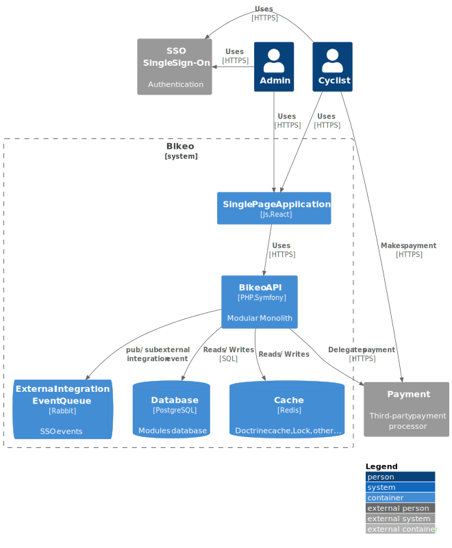

# 🍽️ Food Ordering – Food Ordering System

**Food Ordering** is a web-based application that enables customers to browse restaurant menus, place orders, make payments, and track deliveries. Restaurant staff can manage menus and handle orders. The system integrates with external services for payments, deliveries, and authentication.

---

## 🐳 Running the Application with Docker

To streamline development and testing, the project utilizes Docker along with a `Makefile` to simplify common tasks.

### 🛠️ Makefile Commands

The following commands are available:

- **Start the application**:
  ```bash
  make start
  ```
  

## 🏗️ Architecture
### 🧭 C4 Model
#### 🧱 C1: System Context Diagram

This diagram illustrates the primary actors interacting with the system and its external dependencies.


#### 🧱 C2: Container Diagram

This diagram provides a high-level view of the system's internal architecture, detailing the main containers and their interactions.



## 🧪 Tests

The project includes various levels of tests
Run tests:
  ```bash
  make test
  ```

### 🧪 Unit Tests

- **Location**: `tests/unit`
- **Purpose**: Validate individual components and functions in isolation, primarily within the domain layer.

### 🔗 Integration Tests

- **Location**: `tests/integration`
- **Purpose**: Test the application and infrastructure layers with database access.
  Before running tests, database migrations are executed once - this is controlled by the `APP_RESET_DATABASE` variable, which can be set in `phpunit.xml.dist` or in the environment.
  Each test runs within a separate transaction: it creates the necessary data, performs assertions, and then rolls back the transaction.
  As a result, the database remains empty and unchanged after each test.
### 🏗️ Architectural Tests

- **Location**: `tests/architecture`
- **Purpose**: Ensure the system's architecture aligns with design principles and requirements.

### 🧰 Static Analysis & Code Style
- 🧠 PHPStan – Static Analysis
- 🎨 PHP CS Fixer – Code Style Enforcement
**Purpose**: Maintain high code quality aligns with coding standards.

---
